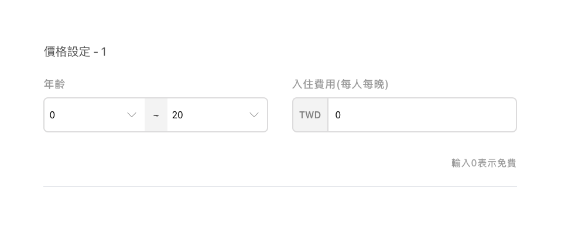

# Pretest

這是一個使用 [CRA](https://create-react-app.dev/) 構建的前測專案。

## 使用工具

- zustand：管理狀態
- clsx：優化 tailwind 版面
- lucide-react：icon 庫
- nanoid：唯一識別 key

## 解題介紹

### 第一題：

使用正規表達式將數字加上千分位的 function

- 檔案位置：/src/lib/addComma.js

- 此題開頭先驗證是否為正常的數字格式(去除 00123，123.00，含有字母或是特殊符號)，並且開放輸入負數及小數輸入。

### 第二題：

請根據如下條件實作找出數字 0 到 20 間重疊與未包含的數字區間 function

- 檔案位置：/src/lib/getNumberIntervals.js

- 解題想法：

  此題理解上來說需要處理兩個部分，第一個部分是重疊的部分，第二個部分是整體沒有被包含在內的部分。

  - 想法 1：透過類似 sliding window 方式，透過指針從左往右漸進涵蓋過去，再撰寫其中邏輯。
    - 時間複雜度：O(n)。
    - 缺點：需要先排序。
  - 想法 2：透過 hashTable，利用 Map 紀錄走訪過的所有元素，並且條件是判斷是否有重疊，使用布林值存起來，這樣可以透過 map.has()來判斷是否 include，也可以用內部 key:value 的布林值判斷是否重疊。
    - 時間複雜度：O(n)。
    - 優點：不需排序。
    - 缺點：即便查詢為 O(1)，在最後也需要再將資料取出整理。

  因想法 2 需先跑完一次陣列，後續又需要整理 Map，最後決定用想法一來實踐。

   

- 解題步驟：

1.  限制只允許輸入二維陣列，不得為空陣列，並且子陣列為只得含有兩個數字 ( ex.
    `[[0,20],[2,20]]`)。

2.  針對子陣列的第一個元素進行排序( 使用 js sort function )。

3.  建立兩個陣列儲存 overlap & notInclude，flag 指標判斷重疊，coverRight 指標判斷涵蓋範圍。

4.  處理第一個子陣列左側邊界是否有涵蓋。

5.  從第二個子陣列開始跑迴圈跑完整個陣列，透過 coverRight 去判斷目前進來的子陣列是否有連續(include)，若沒有連續的部分則將 coverRight 更新至新的子陣列上，若有連續部分則透過 flag 判斷重疊部分。

6.  最後處理最後一個子陣列的右邊界

### 第三題：

實作 PriceInput 元件

- 檔案位置：/src/components/priceInput

- CardWrapper：

  - 負責版面配置使 ageGroupSelect 區塊與 priceInput 區塊相同。
  - 含有 title、childrenComponent、errMsg 和 reMark 區塊。

- PriceInput：

  - 在此將正則及狀態管理複雜邏輯抽出給 usePriceInput custom hook 處理

- InputBox：
  - 負責輸入匡 UI

### 第四題：

實作 AgeGroupSelect 元件

- 檔案位置：/src/components/agGroupSelect

- CardWrapper：

  - 負責版面配置使 ageGroupSelect 區塊與 priceInput 區塊相同。
  - 含有 title、childrenComponent、errMsg 和 reMark 區塊。

- AgeGroupSelect：

  - 外層組件。
  - 因想降低 index prop 傳遞層數，在此進行 getNumberIntervals 判斷 overlap & notInclude，並且處理所需狀態傳遞給子組件&狀態管理庫。

- InputBox：

  - 負責起始年齡以及結束年齡排版。
  - 處理 dropDown 裝態，傳遞給子組件。

- AgeInput：
  - 負責 dropdown UI。
  - 監聽點擊元素外事件。
  - 狀態透過 props 傳進來之 function 儲存起來。

### 第五題：

使用前四題的 Function 和 Component，實作 AgeGroupPriceList UI

- 檔案位置：/src/components/ageGroupPriceList

- Card：

  - 負責每一個 Row card (price & ageGroup)。
  - 負責移除 Card 按鈕

- AgeGroupPriceList：
  - 負責所有 Card 排版
  - 照題目接受一個 onChange function 將 result 丟出
  - 新增 Card 按鈕

 

# 作者資訊

這份前測專案的作者是 [張善寓\_Kenny](https://github.com/kenny02238)。  
如果有任何疑問或建議，請與我聯絡。感謝您的合作！
